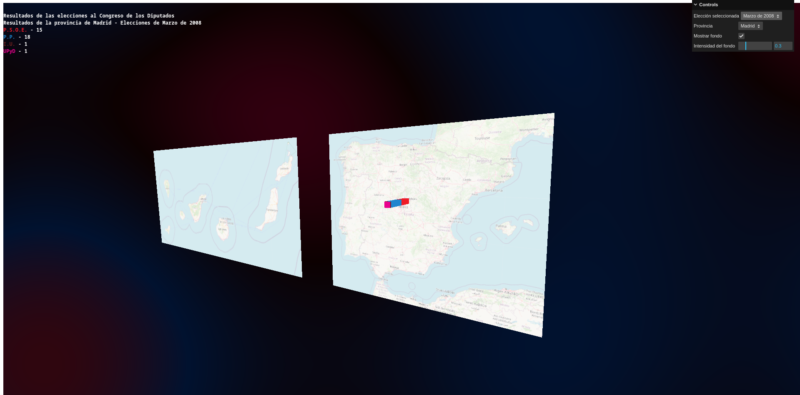
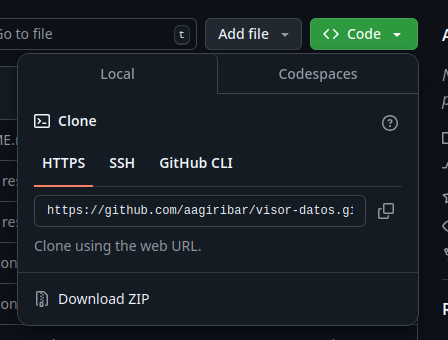
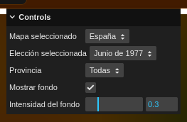
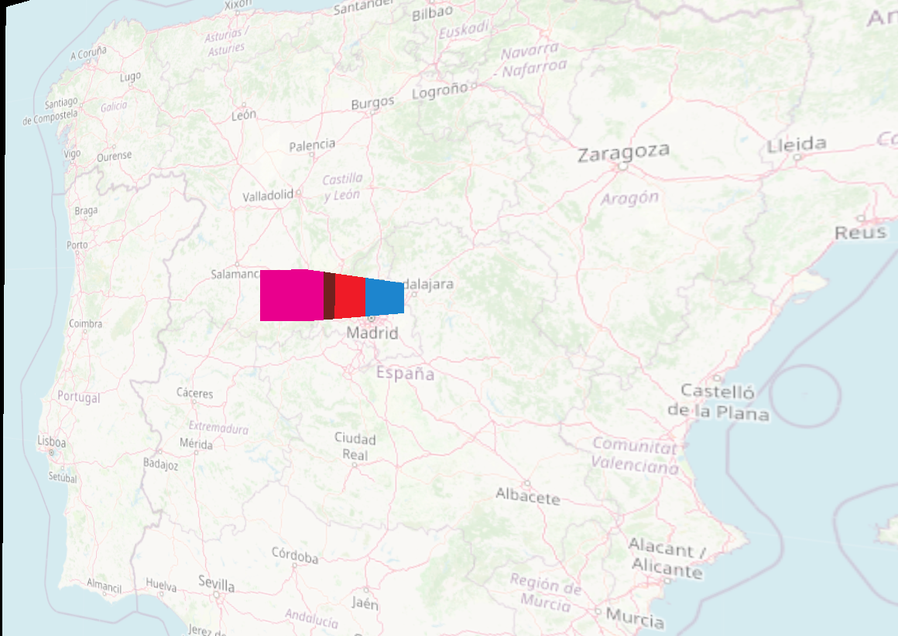
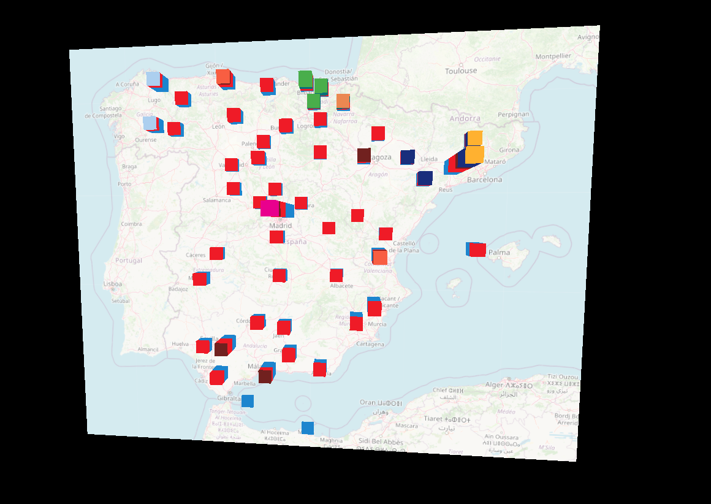
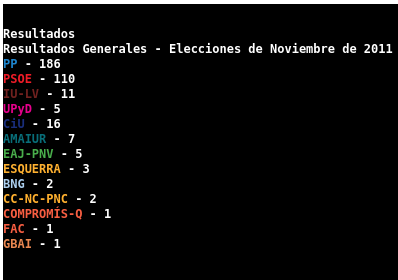
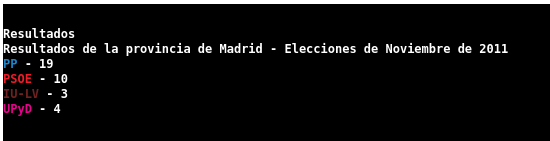

# Visor de resultados electorales
## Agustín Alfonso González Iríbar

Visualización de resultados de las elecciones al Congreso de los Diputados de España por provincias realizada con _three.js_.



## Acceso a la versión web y a vídeo demostrativo

La versión web de este proyecto se encuentra en [este sandbox de codesandbox](https://3gtygw.csb.app/).

El código se puede acceder desde [este enlace](https://codesandbox.io/p/sandbox/3gtygw).

Un vídeo demostrativo de la simulación puede ser encontrado en [este enlace](https://youtu.be/2deQAGUoMj8).

## Ejecución del proyecto en local

A continuación, se detallan las instrucciones de ejecución del proyecto de forma local en caso de que la version web fallara.

1. Descargar o clonar el repositorio



2. Descargar e instalar la version mas reciente de ``Node.js`` desde [este enlace](https://nodejs.org/en)

3. Para asegurar que la instalación se realizó correctamente utilizar los siguientes comandos en un terminal o símbolo del sistema:

```
node --version
npm --version
```

4. Una vez correctamente instalado, ejecutar el siguiente comando desde un terminal o símbolo del sistema en el directorio o carpeta en el que se encuentre el proyecto:

```
npm install
```

5. Una vez termine el comando anterior ejecutar el siguiente comando desde el mismo terminal o simbolo del sístema:

```
npm run start
```

6. Una vez ejecutado este comando se observará en la consola algo parecido a esto:
```
> visor-datos-agustin@1.2.0 start
> parcel ./src/index.html

Server running at http://localhost:1234
```

7. Abrir un navegador y, en la barra de direcciones, escribir ```localhost:1234```

8. Para terminar la simulación, pulsar la combinación de botones ```Ctrl + C``` en la consola donde se realizó el paso 5

## Estructura del proyecto

La estructura de los archivos del código fuente del proyecto, en el directorio ```src``` es la siguiente:

- Directorio ```modules```: Incluye módulos que se encargan de realizar distintas partes de la aplicación:
    
    - ```background.js```: Se encarga de la creación de los objetos relacionados con la escena donde se muestra el fondo de la simulación.
    
    - ```dataObjects.js```: Se encarga de la creación de los objetos utilizados para mostrar los datos (planos con los mapas y cubos que muestran los datos representados).

    - ```gui.js```: Se encarga de la creación de la interfaz de usuario.

    - ```load.js```: Se encarga de la carga de los datos presentes en el directorio __static/data__.

    - ```simObjects.js```: Se encarga de la creación de los objetos de la simulación (escena, cámara, renderer y control órbital).

- Directorio ```shaders```: Almacena los shaders utilizados en la simulación.

- ```datos.js```: Carga los datos, inicializa la simulación y controla el bucle de animación.

- ```index.html```: Fichero __HTML__ en el que se muestra la simulación.

## Datos

Los datos utilizados se encuentran en el directorio **static/data** organizados de la siguiente manera:

### Datos geográficos

En el fichero `datos_geo.csv` se encuentran almacenados los datos geográficos de todas las provincias de España (latitud y longitud)

```
Provincia;Latitud;Longitud
Albacete;38.9941;-1.8584
Alicante/Alacant;38.34731;-0.49902
Almería;36.83800;-2.46059
Araba/Álava;42.85306;-2.69405
```

### Datos electorales

En el directorio `static/data/resultados` se encuentra un fichero `csv` por cada una de las eleccionas que se encuentran visualizadas.

```
Provincia;PP;PSOE;VOX;SUMAR;ERC;JxCAT-JUNTS;EH Bildu;EAJ-PNV;B.N.G.;CCa;U.P.N.
Almería;3;2;1;0;0;0;0;0;0;0;0
Cádiz;4;3;1;1;0;0;0;0;0;0;0
Córdoba;2;2;1;1;0;0;0;0;0;0;0
Granada;3;2;1;1;0;0;0;0;0;0;0
```

### Datos de colores

En el directorio `static/data/colores` se encuentra un fichero `csv` por cada una de las elecciones visualizadas en el que se encuentran los colores de cada partido para poder incluirlo en la visualización.

```
Partido;Color
PP;0x1d85ce
PSOE;0xef1b27
VOX;0x62bf20
SUMAR;0xef4b90
```

## Uso de shaders

La simulación incluye un shader, presente en el fondo de la simulación, que muestra un efecto utilizando los colores de los partidos de los resultados mostrados en ese momento.

Dicho shader se muestra en la simulación utilizando una escena adicional, consistente en un plano con material __ShaderMaterial__ y una cámara ortográfica apuntando hacia él. Dicha escena se renderiza solamente si el usuario ha marcado la opción ```Mostrar fondo``` de la interfaz de usuario.

```javascript
renderer.clear();

if (uiElements["Mostrar fondo"]) {
    // Se renderiza la escene del fondo si el usuario lo desea
    renderer.render(bgScene, bgCamera);
}

// Se renderiza la escena principal
renderer.render(scene, camera);
```

### Uniforms del shader

En cuanto al __shader__, se empieza definiendo el número máximo de colores y se definen una serie de ```uniforms```:

- ```u_time```: Tiempo que lleva funcionando la simulación.

- ```u_colors```: Vector con los colores que se van a utilizar.

- ```u_count```: Número de colores que se van a utilizar.

- ```u_intensity```: Intensidad del shader.

```glsl
#define MAX_COLORS 20

uniform float u_time;
uniform vec3 u_colors[MAX_COLORS];  // Array de tamaño fijo
uniform float u_count;              // Cantidad real de colores en uso
uniform float u_intensity;          // Intensidad del shader
```

Los valores de estos __unifors__ son gestionados desde la aplicación. 

Para controlar el tiempo se utiliza un objeto de tipo ```Clock``` de __Three.js__.

```javascript
const elapsedTime = clock.getElapsedTime();
bgMaterial.uniforms.u_time.value = elapsedTime;
```

Para el vector de colores y el número de colores se utiliza la función ```setBgColorPalette``` del módulo ```background.js``` en la que se genera un vector cuyo tamaño es el número máximo de colores. En este vector se van almacenando los colores de los partidos utilizando el objetos de tipo ```Color``` de __Three.js__ y, cuando ya no hay más partidos, se rellenan los huecos restantes con color negro. Esto es debido a que el shader requiere que ese __uniform__ sea un vector completo.

```javascript
export function setBgColorPalette(colorList) {
    const count = Math.min(colorList.length, MAX_COLORS);
    bgMaterial.uniforms.u_count.value = count;

    let colorArray = new Array(MAX_COLORS);

    for (let i = 0; i < MAX_COLORS; i++) {
        if (i < count) {
            const c = new THREE.Color(parseInt(colorList[i]));
            colorArray[i] = c;
        }
        else {
            colorArray[i] = new THREE.Color(0, 0, 0);
        }
    }
    bgMaterial.uniforms.u_colors.value = colorArray;
}
```

Para la intensidad se utiliza el valor obtenido de la interfaz gráfica y se asigna al shader cuando se modifica el selector correspondiente.

```javascript
bgIntensitySelector = gui.add(uiElements, "Intensidad del fondo", 0.1, 1.0, 0.1);

bgIntensitySelector.onChange((value) => {
    bgMaterial.uniforms.u_intensity.value = value;
});
```

### Efecto de movimiento

Para el efecto se utiliza la función __seno__ tres veces para generar ondas sinoidales verticales, horizontales y radiales. Al sumar estas tres ondas, se cruzan y chocan entre sí generando un patrón de __lámpara de lava__.

Finalmente, se normaliza el valor de la suma de las ondas para que se encuentre en el intérvalo entre 0 y 1.

```glsl
vec2 uv = vUv;
float v = 0.0; // Valor inicial
v += sin(uv.x * 10.0 + u_time * 0.5); // Onda sinoidal vertical
v += sin((uv.y * 8.0 + u_time) * 0.5); // Onda sinoidal horizontal
v += sin(sqrt(uv.x * uv.x + uv.y * uv.y + 1.0) * 10.0 + u_time); // Onda sinoidal radial
v = (v / 3.0 + 1.0) * 0.5; // Normalizamos v de 0.0 a 1.0
```

### Mapeo de la paleta de colores

Una vez obtenido el valor ```v```, este se mapea a un color. Para ello se empieza calculando el índice de colores según el número de colores. Esto delimita los tramos en los que se encuentran los colores según el valor de ```v```.

A continuación, se mapea el valor de ```v``` dentro de este índice separando la parte entera del índice para indicar el color y la parte decimal para indicar la distancia con el siguiente color.

```glsl
// --- Lógica de Mezcla Dinámica ---
    
// Aseguramos que haya al menos 2 colores para evitar errores
// Si hay un solo color, se usará el siguiente en el array (que es negro)
if (count < 2.0) {
    count = 2.0;
}

// Calculamos el índice basado en 'v' y la cantidad de colores
// Si tenemos 5 colores, el rango va de 0 a 4.
float totalSegments = float(count) - 1.0;
    
// Mapeamos 0..1 al rango de índices (ej: 0..4.0)
float v_scaled = v * totalSegments; 
    
// Obtenemos el índice inferior (piso) y la fracción para mezclar
int index = int(floor(v_scaled));
float t = fract(v_scaled); // Cuánto estamos entre el color actual y el siguiente

// Protección para el último pixel exacto (v=1.0)
if (float(index) >= count - 1.0) {
    index = int(count) - 2; // Retrocedemos uno para mezclar el penúltimo con el último
    t = 1.0;
}
```

### Mezcla de colores

Por último, se mezclan los colores utilizando el índice para eligir el color y la parte decimal para elegir como se mezclan los colores.

```glsl
// Obtenemos los dos colores a mezclar
vec3 colorA = u_colors[index];
vec3 colorB = u_colors[index + 1];

// Mezclamos
vec3 finalColor = mix(colorA, colorB, t);

gl_FragColor = vec4(finalColor * u_intensity, 1.0);
```

## Controles de la simulación

La cámara se puede controlar con el ratón. Para mover la cámara basta con clicar y arrastrar y se puede hacer zoom con la rueda del ratón.

La simulación incluye un panel de control con diferentes opciones explicadas a continuación.



### Selector de mapa

El selector denominado __Mapa seleccionado__ permite cambiar sobre que mapa orbita la cámara (`España` o `Canarias`).

Este selector solo está disponible cuando se visualizan los resultados de todas las provincias.

### Selector de proceso electoral

El selector denominado __Elección seleccionada__ permite seleccionar el proceso electoral a visualizar. En las opciones aparace el mes y el año de cada proceso electoral que se puede visualizar.

### Selector de provincia

El selector denominado __Provincia__ permite seleccionar la provincia sobre la que se quieren visualizar datos. Al seleccionar una provincia se eliminarán del mapa todos los datos que no correspondan a esa provincia. Además, la cámara pasará a orbitar alrededor de los datos de la provincia seleccionada.



Para volver a visualizar el resto de provincias basta con seleccionar la opción `Todas`.



### Selector de mostrar fondo

El selector denominado __Mostrar fondo__ permite elegir si se desea o no visualizar el __shader__ de fondo de la simulación.


### Selector de intensidad del fondo

El selector denominado __Intensidad del fondo__ permite seleccionar el nivel de intensidad al que se visualiza el __shader__ en un intérvalo entre ```0.1``` y ```1.0```.


## Visualización de resultados

En la parte superior izquierda de la pantalla se pueden visualizar el número de escaños de cada partido.

Al seleccionar todas las provincias, se visualizarán los resultados a nivel nacional.



Al seleccionar una provincia se pueden visualizar los resultados por partido en esa provincia.



## Referencias
Los resultados electorales han sido sacados de la [Web de Información Electoral del Ministerio del Interior](https://infoelectoral.interior.gob.es/es/inicio/).
